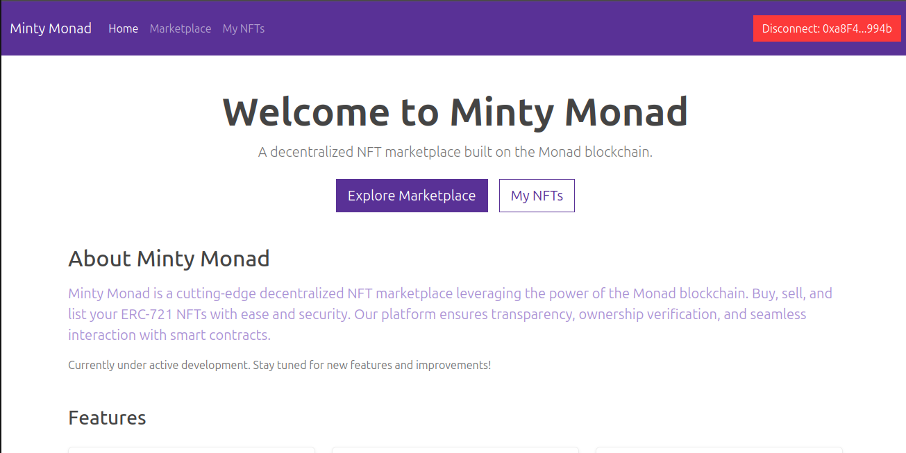
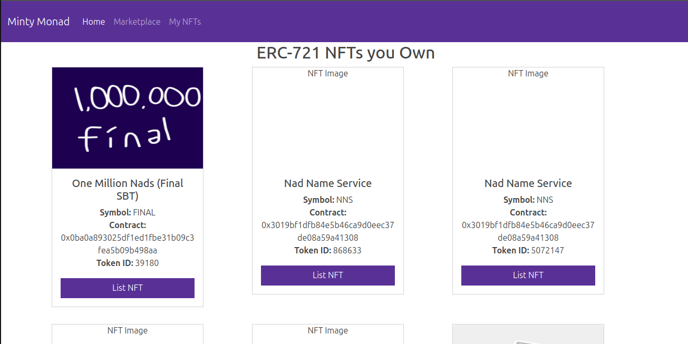
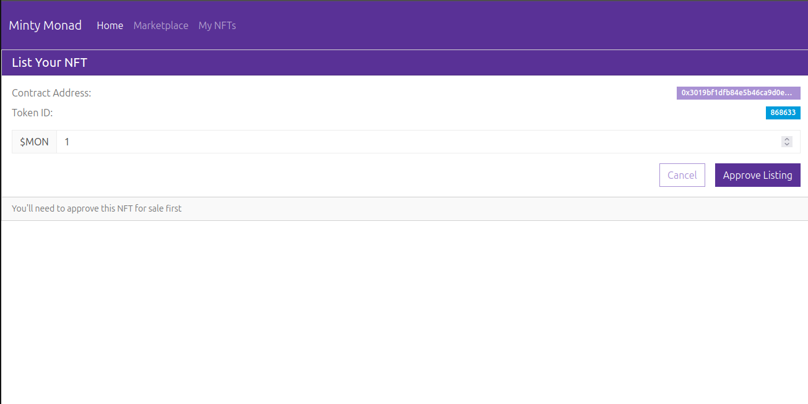
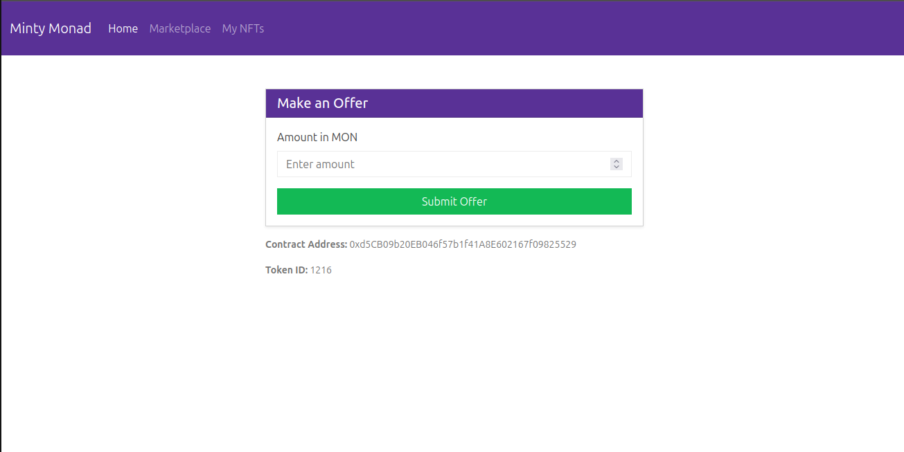
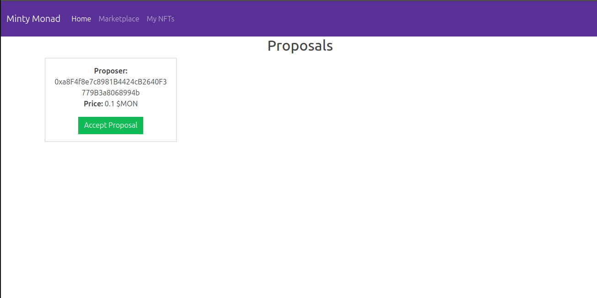
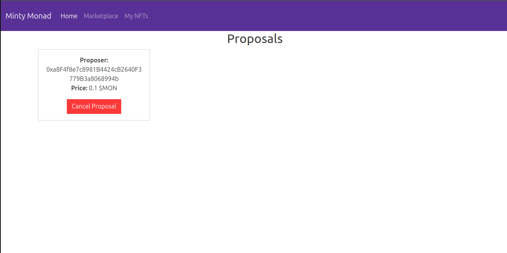
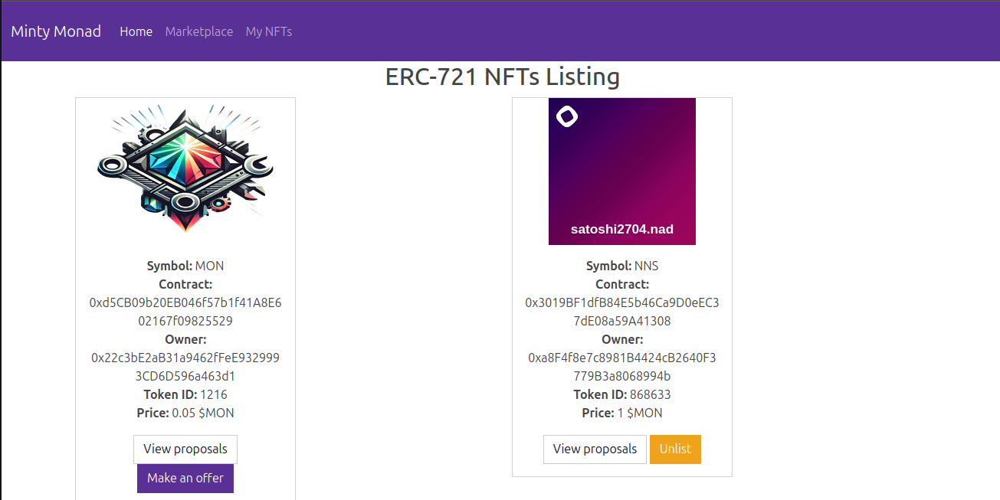

# MintyMonad

A decentralized NFT marketplace built on the Monad blockchain.
---
### Environment variables
- `SECRET_KEY`: Flask session secret.
- `ALCHEMY_API_KEY`: Alchemy API key.
- `NFT_MARKETPLACE_CONTRACT_ADDRESS`: Deployed marketplace contract address.
- `MONAD_RPC_URL` or `MONAD_RPC`: RPC URL for Monad testnet.
- Optional overrides:
	- `MONAD_CHAIN_ID` (default `10143`), `MONAD_CHAIN_NAME`, `MONAD_NATIVE_NAME`, `MONAD_NATIVE_SYMBOL`, `MONAD_NATIVE_DECIMALS`, `MONAD_EXPLORER_URL`, `MONAD_BLOCK_GAS_LIMIT`.

### Run locally
```bash
export FLASK_APP=manage.py
flask run
```

### Frontend config
Frontend scripts load testnet configuration from `/api/network_config`. Avoid hardcoding RPC or chain parameters in JS.


**NFT Marketplace Contract Address:** `0x02F54869f96E809828d68c3D6D88482d00Aa08ae`

## Features

* **NFT Listings**: List ERC721 NFTs with a fixed price.
* **Buy NFTs**: Purchase listed NFTs using MON (native token).
* **Proposals/Offers**: Make offers on NFTs which are held in the contract until accepted or canceled.
* **Accept Proposals**: Sellers can accept a proposal; NFT is transferred to the buyer and funds are sent to the seller.
* **Automatic Refunds**: All other proposers are refunded when a proposal is accepted.
* **Cancel Proposals**: Users can cancel their proposals to get their funds back.
* **Admin Functions**: Set marketplace fees and withdraw collected fees.
* **Web Interface**: User-friendly interface built with Bootstrap and JavaScript.

---

## Tech Stack

* **Smart Contract**: Vyper 0.3.10
* **Blockchain**: Monad Testnet
* **Backend**: Python Flask
* **Frontend**: JavaScript + Bootstrap
* **Wallet Interaction**: ether.js


---

## Setup & Installation

1. **Clone the repository**:

```bash
git https://github.com/zhnr01/MintyMonad
cd MintyMonad
```

2. **Install Python dependencies**:

```bash
python3 -m venv env
source env/bin/activate
pip install -r requirements.txt
```

3. **Configure `.env`**:

```python
PRIVATE_KEY=
ACCOUNT_ADDRESS=
MONAD_RPC=https://testnet-rpc.monad.xyz
ALCHEMY_API_KEY=
SECRET_KEY=
NFT_MARKETPLACE_CONTRACT_ADDRESS=
```

4. **Run deploy.py to deploy contract**:

```bash
python deploy.py
```
**Run create_db.py to create database**
```bash
python create_db.py
```

**Run manage.py**
```bash
python manage.py
```

5. Open `http://127.0.0.1:5000` in your browser.

---

## Usage
* **Main Page**: Connect your wallet on the main page.

* **List an NFT**: Approve the marketplace contract, and set a price.


* **Make a Proposal**: Submit an offer for an NFT. Your MON is held in the contract.

* **Accept Proposal**: As the seller, accept a proposal to transfer the NFT and receive funds. 
Other proposers are refunded automatically.

* **Cancel Proposal**: Cancel your proposal to get your funds back.

* **Unlist NFT**: Click *Unlist* button to unlist it from marketplace.
* **View Proposals**: Click *View Proposals* button to view proposals.

---
## Notes
* This project is **not production ready** — use only for testing or development.